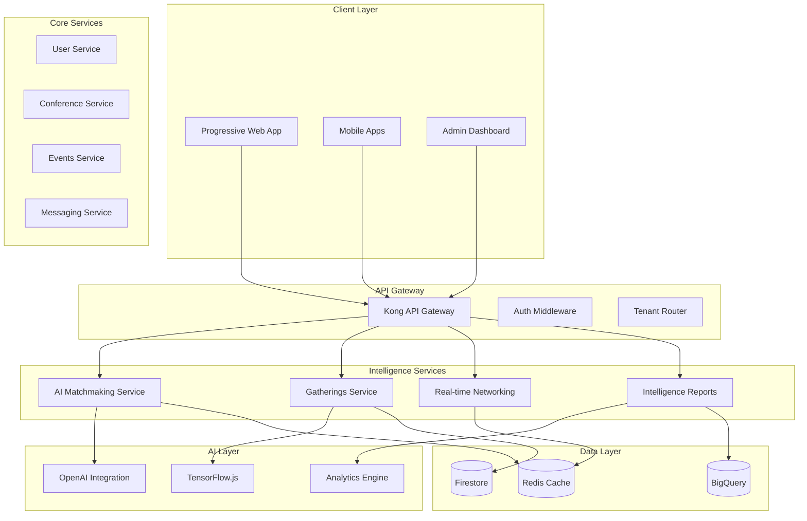

# 🧠 Conference Intelligence Platform - Microservices Architecture

## Vision
**Transform conference interactions from random networking to strategic, data-driven professional connections.**

## Success Metrics
- **User Delight**: 70+ Net Promoter Score
- **Business Value**: 10,000+ monthly report shares  
- **Product Quality**: 99.9% uptime, <0.1% error rate
- **Performance**: <100ms API response time

## 🏗️ Microservices Architecture

### Core Services



## 🎯 Service Definitions

### 1. AI Matchmaking Service (`/services/ai-matchmaking`)
**Purpose**: Intelligent attendee matching with AI-powered compatibility scoring

**Features**:
- Multi-signal matching algorithm
- AI-powered conversation starters
- Personalized recommendations
- Learning from feedback

**Tech Stack**:
- Node.js + TypeScript
- OpenAI GPT-4 integration
- Redis for real-time caching
- TensorFlow.js for ML models

**API Endpoints**:
```typescript
POST /api/v1/matching/calculate
GET  /api/v1/matching/recommendations/:userId
POST /api/v1/matching/conversation-starters
POST /api/v1/matching/feedback
```

### 2. Spontaneous Gatherings Service (`/services/gatherings`)
**Purpose**: Smart gathering creation with intelligent attendee targeting

**Features**:
- Auto-invitation system
- Optimal venue suggestions
- Time slot optimization
- Group dynamics analysis

**Tech Stack**:
- Python + FastAPI
- Scikit-learn for clustering
- Redis for session management
- WebSockets for real-time updates

**API Endpoints**:
```typescript
POST /api/v1/gatherings/create
POST /api/v1/gatherings/auto-invite
GET  /api/v1/gatherings/suggestions
WS   /api/v1/gatherings/live/:gatheringId
```

### 3. Real-time Networking Service (`/services/networking`)
**Purpose**: Instant messaging and real-time connection management

**Features**:
- Push notifications
- Instant messaging
- Presence detection
- Background sync

**Tech Stack**:
- Go + Fiber framework
- WebRTC for video calls
- Firebase Cloud Messaging
- Redis Pub/Sub

**API Endpoints**:
```typescript
WS   /api/v1/networking/connect
POST /api/v1/networking/message
GET  /api/v1/networking/presence/:userId
POST /api/v1/networking/notify
```

### 4. Intelligence Reports Service (`/services/intelligence`)
**Purpose**: Post-conference analytics and ROI reporting

**Features**:
- Executive-level reports
- Competitive intelligence
- Lead qualification scores
- ROI calculations

**Tech Stack**:
- Python + Django
- BigQuery for analytics
- Pandas for data processing
- GPT-4 for insights generation

**API Endpoints**:
```typescript
POST /api/v1/intelligence/generate-report
GET  /api/v1/intelligence/roi/:conferenceId
GET  /api/v1/intelligence/competitors/:tenantId
GET  /api/v1/intelligence/leads/:userId
```

## 🏢 Multi-Tenant Architecture

### Tenant Isolation Strategy

```yaml
Tenant Identification:
  - Subdomain: {tenant}.conference-intel.com
  - JWT Claim: tenantId
  - Header: X-Tenant-ID

Data Isolation:
  - Database: /tenants/{tenantId}/collections
  - Cache: {tenantId}:{key}
  - Storage: /storage/{tenantId}/
  - Queues: {service}.{tenantId}.{queue}

Configuration:
  - Branding: /config/{tenantId}/branding.json
  - Features: /config/{tenantId}/features.json
  - Limits: /config/{tenantId}/limits.json
```

### Supported Tenants

| Tenant | Domain | Features | Tier |
|--------|--------|----------|------|
| Gamescom | gamescom.conference-intel.com | Full | Enterprise |
| MAU 2025 | mau2025.conference-intel.com | Full | Enterprise |
| E3 | e3.conference-intel.com | Full | Enterprise |
| Demo | demo.conference-intel.com | Limited | Free |

## 📊 Data Models

### User Profile (Multi-dimensional)
```typescript
interface UserProfile {
  // Identity
  id: string;
  tenantId: string;
  conferenceIds: string[];
  
  // Professional
  industry: Industry;
  role: Role;
  company: Company;
  skills: Skill[];
  interests: Interest[];
  
  // Networking
  goals: NetworkingGoal[];
  preferences: MatchingPreferences;
  availability: TimeSlot[];
  
  // Intelligence
  behaviorProfile: BehaviorProfile;
  networkValue: NetworkValueScore;
  influenceScore: number;
}
```

### Conference Intelligence
```typescript
interface ConferenceIntelligence {
  conferenceId: string;
  tenantId: string;
  
  // Metrics
  totalAttendees: number;
  totalConnections: number;
  avgMatchScore: number;
  
  // Insights
  topNetworkers: User[];
  emergingTrends: Trend[];
  keyCompanies: Company[];
  
  // ROI
  estimatedDeals: Deal[];
  leadQuality: LeadScore[];
  networkGrowth: GrowthMetrics;
}
```

## 🚀 Implementation Phases

### Phase 1: Core Infrastructure (Weeks 1-3)
- [ ] Setup microservices scaffolding
- [ ] Configure Kong API Gateway
- [ ] Implement tenant isolation
- [ ] Setup monitoring stack

### Phase 2: Intelligence Services (Weeks 4-6)
- [ ] AI Matchmaking Service
- [ ] Basic gathering creation
- [ ] Real-time messaging
- [ ] Simple analytics

### Phase 3: AI Enhancement (Weeks 7-9)
- [ ] GPT-4 integration
- [ ] TensorFlow.js models
- [ ] Conversation starters
- [ ] Predictive analytics

### Phase 4: Advanced Features (Weeks 10-12)
- [ ] Executive reports
- [ ] Competitive intelligence
- [ ] Auto-invitations
- [ ] ROI calculations

## 🔧 Technology Stack

### Frontend
- **Framework**: SvelteKit (as per document)
- **PWA**: Service Workers + IndexedDB
- **Real-time**: WebSockets
- **State**: Svelte stores

### Backend
- **Languages**: Node.js, Python, Go
- **Databases**: Firestore, Redis, BigQuery
- **AI/ML**: OpenAI, TensorFlow.js
- **Messaging**: RabbitMQ, Redis Pub/Sub

### Infrastructure
- **Container**: Docker + Kubernetes
- **CI/CD**: GitHub Actions
- **Monitoring**: Prometheus + Grafana
- **Tracing**: Jaeger

## 📈 Performance Requirements

| Metric | Target | Critical |
|--------|--------|----------|
| API Response Time | <100ms | <500ms |
| Match Calculation | <2s | <5s |
| Report Generation | <10s | <30s |
| WebSocket Latency | <50ms | <200ms |
| Uptime | 99.9% | 99.5% |
| Error Rate | <0.1% | <1% |

## 🔐 Security & Compliance

### Security Measures
- End-to-end encryption for messages
- JWT with short expiry (15 min)
- API rate limiting per tenant
- DDoS protection via Cloudflare
- Regular security audits

### Compliance
- GDPR compliant data handling
- Right to erasure implementation
- Data portability APIs
- Consent management system
- Audit logging

## 🎨 Tenant Customization

### Branding
- Custom domains
- Logo and color schemes
- Email templates
- Report templates

### Features
- Enable/disable services
- Custom matching algorithms
- Specific report types
- Integration options

### Limits
- API rate limits
- Storage quotas
- User limits
- Report frequency

## 📱 Offline Support

### Progressive Web App
- Service Worker caching
- IndexedDB for local data
- Background sync for messages
- Offline match viewing
- Queue actions for sync

### Sync Strategy
```typescript
interface SyncStrategy {
  priority: 'high' | 'medium' | 'low';
  retry: RetryPolicy;
  conflictResolution: 'server-wins' | 'client-wins' | 'merge';
  batchSize: number;
}
```

## 🔄 Migration Strategy

### From Monolith to Microservices

1. **Identify Boundaries**
   - Extract matchmaking first
   - Then gatherings
   - Then networking
   - Finally intelligence

2. **Gradual Migration**
   - Strangler Fig pattern
   - Feature flags for rollout
   - Parallel run period
   - Gradual traffic shift

3. **Data Migration**
   - ETL pipelines
   - Zero-downtime migration
   - Rollback procedures
   - Data validation

## 🎯 Success Criteria

### Technical KPIs
- [ ] <100ms P95 latency
- [ ] 99.9% uptime achieved
- [ ] <0.1% error rate
- [ ] 10,000 concurrent users supported

### Business KPIs
- [ ] 70+ NPS score
- [ ] 10,000+ report shares/month
- [ ] 50% user activation rate
- [ ] 30% daily active users

### User Experience KPIs
- [ ] <3 seconds initial load
- [ ] Offline functionality working
- [ ] Push notifications delivered
- [ ] Real-time updates functioning

## 📚 Next Steps

1. **Immediate Actions**
   - Setup development environment
   - Create service repositories
   - Configure CI/CD pipelines
   - Deploy API Gateway

2. **Week 1 Goals**
   - Matchmaking service MVP
   - Basic tenant isolation
   - Authentication flow
   - Monitoring setup

3. **Month 1 Targets**
   - 3 core services deployed
   - AI integration working
   - Multi-tenant routing
   - Basic reporting
